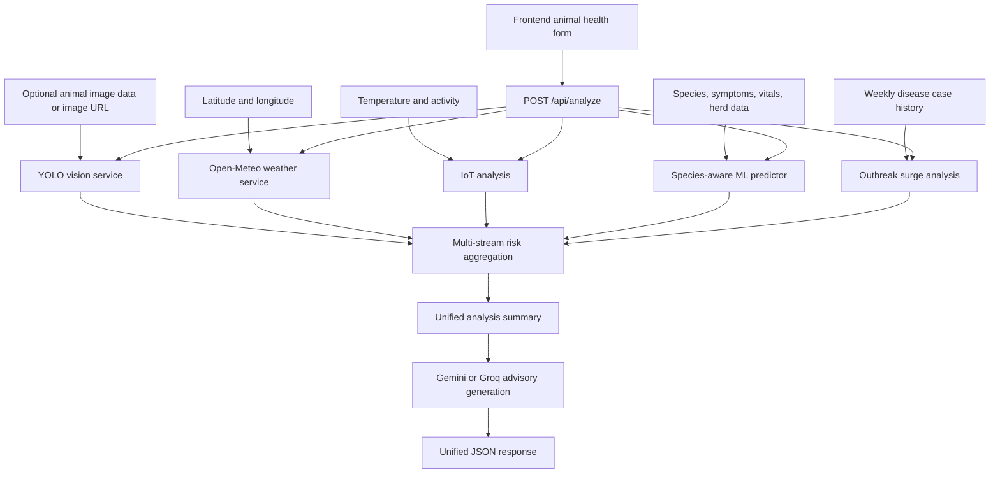

# Livestock Health Intelligence API

Frontend integration documentation for the PS128 backend.

## 1. API Basics

- Local base URL: `http://localhost:8000`
- API base path: `/api`
- Interactive API documentation: `http://localhost:8000/docs`
- ReDoc: `http://localhost:8000/redoc`
- Supported CORS origins are configured in `ALLOWED_ORIGINS`.

The recommended frontend workflow is:

1. Collect the animal health form data.
2. Collect location and optional IoT data.
3. Optionally provide an animal image for YOLO visual inspection.
4. Send the complete payload to `POST /api/analyze`, including the `yolo_vision_analysis` result from the image step.
5. Render the returned risk score, disease prediction, sensor anomalies, weather risk, outbreak status, and farmer advisory.

The individual endpoints can also be used for separate dashboard cards or independent tests.

## 2. End-to-End Data Flow



The backend combines the signals in this order:

1. YOLO visual inspection, if image input is available.
2. Weather risk lookup using latitude and longitude.
3. IoT telemetry normalization and anomaly detection.
4. Disease prediction from symptoms and health information.
5. Historical case surge calculation.
6. Overall risk score and risk level calculation.
7. GenAI advisory generation using the combined analysis.

## 3. Primary Endpoint: Complete Analysis

### `POST /api/analyze`

This is the main endpoint for the frontend dashboard. It accepts JSON and returns one combined analysis object.

### Request body

```json
{
  "latitude": 28.6139,
  "longitude": 77.209,
  "language": "English",
  "health_report": {
    "animal": "Cow",
    "symptoms": [
      "Fever",
      "Nasal Discharge",
      "Labored Breathing",
      "Coughing"
    ],
    "heart_rate": 95,
    "duration_days": 3,
    "affected_count": 2,
    "herd_size": 10,
    "mortality_count": 0
  },
  "iot_telemetry": {
    "animal_id": "ESP32-COW-01",
    "temperature": 40.1,
    "activity": 22,
    "simulate_fever": false
  },
  "yolo_vision_analysis": {
    "visual_anomaly_detected": true,
    "primary_prediction": "Lumpy Skin Disease",
    "confidence": 98.5
  },
  "historical_weekly_cases": [12, 14, 11, 15, 13, 48]
}
```

### Request fields

| Field | Type | Required | Description |
|---|---|---:|---|
| `latitude` | number | No | Animal location latitude. Defaults to `28.6139`. |
| `longitude` | number | No | Animal location longitude. Defaults to `77.2090`. |
| `language` | string | No | Language requested for the GenAI advisory. Defaults to `English`. |
| `health_report` | object | No | Symptoms, species, heart rate, herd, and epidemiology details. |
| `health_report.animal` | string | No | Species, normally `Cow`, `Pet`, or another supported model category. |
| `health_report.symptoms` | string[] or string | No | Symptoms used by the ML disease predictor. Defaults to `['Fever']`. |
| `health_report.heart_rate` | number | No | Heart rate used by the ML model. Defaults to `85.0`. |
| `health_report.duration_days` | integer | No | Duration entered by the user. Stored in the request, but not currently passed to the ML model. |
| `health_report.affected_count` | integer | No | Number of affected animals. |
| `health_report.herd_size` | integer | No | Total herd size. |
| `health_report.mortality_count` | integer | No | Number of deaths. |
| `iot_telemetry` | object | No | Live sensor data or simulation controls. |
| `iot_telemetry.animal_id` | string | No | Sensor or animal identifier. |
| `iot_telemetry.temperature` | number | No | Core temperature in Celsius. If omitted, the backend simulates telemetry. |
| `iot_telemetry.activity` | integer | No | Activity index. Values below `30` are treated as lethargy. |
| `iot_telemetry.simulate_fever` | boolean | No | Requests fever simulation when temperature is omitted. |
| `yolo_vision_analysis` | object | No | YOLO result returned by `/api/predict`; pass it here to avoid running image inference again. |
| `historical_weekly_cases` | integer[] | No | Weekly case counts. Defaults to `[10, 12, 11, 13, 12, 14]`. |

### Unified response shape

```json
{
  "overall_risk_score": 90,
  "overall_risk_level": "CRITICAL",
  "disease_prediction": {
    "suspected_condition": "Foot and Mouth Disease",
    "confidence": 0.85,
    "animal_type": "Cow",
    "vitals_evaluated": {
      "body_temp": 40.1,
      "heart_rate": 95
    },
    "symptoms_analyzed": "Fever Nasal Discharge Labored Breathing Coughing",
    "epidemiology_context": {
      "affected_count": 2,
      "herd_size": 10,
      "mortality_count": 0
    }
  },
  "yolo_vision_analysis": null,
  "iot_telemetry_analysis": {
    "animal_id": "ESP32-COW-01",
    "temperature": 40.1,
    "activity_index": 22,
    "has_anomaly": true,
    "anomalies": [
      "Hyperthermia: 40.1°C",
      "Lethargy: Activity index 22"
    ]
  },
  "weather_analysis": {
    "temperature": 28.0,
    "humidity": 80.0,
    "precipitation": 0.0,
    "vector_breeding_risk": "HIGH",
    "weather_advisory": "High humidity indicates elevated vector risk.",
    "source": "Live Open-Meteo API"
  },
  "outbreak_surge_analysis": {
    "latest_cases": 48,
    "historical_mean": 13.0,
    "z_score": 35.0,
    "is_outbreak_spike": true
  },
  "farmer_advisory": {
    "language": "English",
    "advisory": "...",
    "provider_used": "Gemini (Key 1)"
  }
}
```

## 4. ML Disease Prediction

The master endpoint calls the species-aware ML predictor with:

- Species from `health_report.animal`
- Symptoms from `health_report.symptoms`
- IoT temperature as `body_temp`
- `health_report.heart_rate`
- Affected animal count, herd size, and mortality count

The ML response contains:

```json
{
  "suspected_condition": "Foot and Mouth Disease",
  "confidence": 0.85,
  "animal_type": "Cow",
  "vitals_evaluated": {
    "body_temp": 40.1,
    "heart_rate": 95
  },
  "symptoms_analyzed": "Fever Coughing",
  "epidemiology_context": {
    "affected_count": 2,
    "herd_size": 10,
    "mortality_count": 0
  }
}
```

`confidence` is a decimal probability between `0` and `1` in the ML response. The master risk calculation treats confidence above `0.20` as a positive risk signal.

If the ML pipeline file is unavailable, the response reports `Model Pipeline Not Loaded` with confidence `0.0`. The frontend should display this as a model availability warning, not as a confirmed disease.

## 5. YOLO Image Prediction

### `POST /api/predict`

This endpoint accepts multipart form data:

- `file`: image file; required
- `category`: animal category; required. Expected values include `pet`, `dog`, `cat`, `cow`, or `cattle`.

Example frontend request:

```javascript
const formData = new FormData();
formData.append("file", selectedImage);
formData.append("category", "cow");

const response = await fetch("http://localhost:8000/api/predict", {
  method: "POST",
  body: formData
});

const result = await response.json();
```

Successful response:

```json
{
  "success": true,
  "yolo_result": {
    "visual_anomaly_detected": true,
    "primary_prediction": "Lumpy Skin Disease",
    "confidence": 92.4,
    "top_predictions": [
      {
        "condition": "Lumpy Skin Disease",
        "confidence": 92.4
      }
    ]
  },
  "data": {
    "visual_anomaly_detected": true,
    "primary_prediction": "Lumpy Skin Disease",
    "confidence": 92.4,
    "top_predictions": [
      {
        "condition": "Lumpy Skin Disease",
        "confidence": 92.4
      },
      {
        "condition": "Healthy",
        "confidence": 5.1
      }
    ]
  }
}
```

YOLO display labels are formatted as:

| Raw class | Display label |
|---|---|
| `lumpy` | `Lumpy Skin Disease` |
| `foot-and-mouth` | `Foot and Mouth Disease` |
| `healthy` | `Healthy` |

For object detection models, the response uses `all_detections` instead of `top_predictions`:

```json
{
  "primary_prediction": "Lumpy Skin Disease",
  "confidence": 88.2,
  "all_detections": [
    {
      "condition": "Lumpy Skin Disease",
      "confidence": 88.2
    }
  ]
}
```

## 6. IoT Telemetry

### `POST /api/iot/data`

Use this endpoint when the frontend needs a standalone sensor card or wants to test sensor input before running a complete analysis.

Request:

```json
{
  "animal_id": "ESP32-COW-01",
  "temperature": 40.1,
  "activity": 22,
  "use_simulation": false,
  "simulate_fever": false
}
```

Response:

```json
{
  "animal_id": "ESP32-COW-01",
  "temperature": 40.1,
  "activity_index": 22,
  "has_anomaly": true,
  "anomalies": [
    "Hyperthermia detected: Core temp 40.1°C exceeds 39.5°C threshold.",
    "Lethargy detected: Movement activity index (22) is critically low."
  ]
}
```

Current anomaly thresholds:

- Temperature above `39.5°C`: hyperthermia
- Temperature below `37.5°C`: hypothermia
- Activity below `30`: lethargy

If `use_simulation` is true, or if `temperature` is omitted, the backend generates simulated telemetry.

## 7. Weather Risk

### `POST /api/weather/risk`

Request:

```json
{
  "latitude": 28.6139,
  "longitude": 77.209
}
```

The weather service calls Open-Meteo without an API key and evaluates temperature, humidity, and precipitation:

- `HIGH`: temperature above `24°C` with humidity above `70%`, or precipitation above `1 mm`
- `MEDIUM`: temperature above `20°C` with humidity above `55%`
- `LOW`: otherwise

The service response is intended to contain:

```json
{
  "temperature": 28.0,
  "humidity": 80.0,
  "precipitation": 0.0,
  "vector_breeding_risk": "HIGH",
  "weather_advisory": "High vector breeding risk: Mosquito and fly activity elevated due to high humidity/rainfall.",
  "source": "Live Open-Meteo API"
}
```

If Open-Meteo is unavailable, an offline fallback response is returned with `source: "Offline Fallback"`.

## 8. Outbreak Trend Analysis

### `POST /api/trends/analyze`

Request:

```json
{
  "region_id": "DISTRICT-001",
  "disease_name": "Lumpy Skin Disease",
  "current_week_cases": 48,
  "historical_weekly_cases": [12, 14, 11, 15, 13]
}
```

Response:

```json
{
  "trend": "SURGE_ALERT",
  "is_outbreak_spike": true,
  "historical_average": 13.0,
  "percentage_increase": 269.23,
  "message": "Abnormal statistical surge detected (Z-Score: 35.00, +269.2% vs baseline)."
}
```

Trend values:

- `STABLE`: within expected variation
- `INCREASING`: more than 25% above baseline without a surge alert
- `SURGE_ALERT`: statistical surge or at least a 100% increase with at least 5 current cases

## 9. GenAI Farmer Advisory

### `POST /api/advisory/generate`

This endpoint accepts an already-combined `analysis_data` object. It does not run ML, YOLO, IoT, weather, or trend analysis by itself.

Request:

```json
{
  "language": "English",
  "analysis_data": {
    "overall_risk_score": 90,
    "overall_risk_level": "CRITICAL",
    "disease_prediction": {
      "suspected_condition": "Foot and Mouth Disease",
      "confidence": 0.85
    },
    "yolo_vision_analysis": {
      "primary_prediction": "Lumpy Skin Disease",
      "confidence": 92.4
    },
    "iot_telemetry_analysis": {
      "anomalies": ["Hyperthermia: 40.1°C"]
    },
    "weather_analysis": {
      "vector_breeding_risk": "HIGH"
    },
    "outbreak_surge_analysis": {
      "is_outbreak_spike": true
    }
  }
}
```

The advisory service chooses the disease name in this order:

1. `yolo_vision_analysis.primary_prediction`, if present and non-empty
2. `disease_prediction.suspected_condition`
3. `Unknown Condition`

The GenAI prompt receives:

- Disease name
- Overall risk level and score
- IoT anomaly list
- Weather vector breeding risk
- Regional outbreak spike status
- Requested language

The service tries Gemini key 1, Gemini key 2, and then Groq. If all providers fail, it returns a static emergency advisory with `provider_used: "Static Fallback"`.

Response:

```json
{
  "language": "English",
  "advisory": "🚨 DIAGNOSIS: ...",
  "provider_used": "Gemini (Key 1)"
}
```

The advisory is intended to be short, mobile-friendly, and focused on isolation or treatment, contacting a veterinarian, and vector control or disinfection.

## 10. Frontend Form and Screen Mapping

| Frontend UI element | Backend field or endpoint |
|---|---|
| Animal species selector | `health_report.animal` |
| Symptom multi-select or text input | `health_report.symptoms` |
| Heart rate input | `health_report.heart_rate` |
| Temperature from device/manual input | `iot_telemetry.temperature` |
| Activity index from device/manual input | `iot_telemetry.activity` |
| Animal or sensor ID | `iot_telemetry.animal_id` |
| Herd size | `health_report.herd_size` |
| Affected animal count | `health_report.affected_count` |
| Mortality count | `health_report.mortality_count` |
| Symptom duration | `health_report.duration_days` |
| Map location or GPS | `latitude`, `longitude` |
| Weekly case history | `historical_weekly_cases` |
| Language selector | `language` |
| Animal image upload | `/api/predict` multipart `file` and `category`; see current limitation below |

Recommended result components:

- Risk score gauge using `overall_risk_score` from `0` to `100`
- Risk badge using `overall_risk_level`: `LOW`, `ELEVATED`, or `CRITICAL`
- Disease card using `disease_prediction.suspected_condition` and `confidence`
- Visual diagnosis card using `yolo_vision_analysis.primary_prediction` and confidence
- Sensor card using temperature, activity, and anomalies
- Weather card using vector risk, advisory, humidity, and precipitation
- Outbreak card using trend, latest cases, historical mean, and spike status
- Advisory panel using `farmer_advisory.advisory`
- Provider/debug label using `farmer_advisory.provider_used` only if needed for internal diagnostics

## 11. Error Handling

Typical HTTP responses:

| Status | Meaning |
|---:|---|
| `200` | Request completed successfully |
| `400` | Invalid image or unsupported animal category on `/api/predict` |
| `422` | FastAPI/Pydantic validation error; request body or required form field is invalid |
| `500` | Backend service, model, external API, or advisory provider failure |

For `422` responses, FastAPI returns a `detail` array containing the invalid field location and validation message.

For `500` responses, show a retry state and preserve the user-entered form. Do not treat a failed GenAI call as a failed disease analysis when the master response includes a static fallback advisory.

## 12. Current Backend Integration Notes

These items should be resolved or confirmed before production frontend integration:

1. The recommended image flow is two-stage: call `/api/predict`, then pass its `yolo_result` object as `yolo_vision_analysis` in `/api/analyze`.
2. `/api/analyze` receives JSON, while `/api/predict` receives the image as multipart form data. A browser `File` cannot be placed directly inside the `/api/analyze` JSON body.
3. If `yolo_vision_analysis` is omitted, `/api/analyze` can still process an `image_data` or `image_url` value when the backend vision method is used.
4. The weather service returns `temperature`, `humidity`, and `precipitation`. The analytics route imports a response schema using `temperature_c`, `relative_humidity_pct`, and `precipitation_mm`. The backend schema and route should be aligned before relying on `/api/weather/risk` response validation.
5. The main application registers the routes from `app/routes`, so the active paths include `/api/health`, `/api/predict`, `/api/iot/data`, `/api/weather/risk`, `/api/trends/analyze`, `/api/analyze`, and `/api/advisory/generate`.
6. Disease and advisory results are decision-support outputs. The frontend should display confidence and risk context and should direct the farmer to a veterinarian for treatment decisions.

## 13. Minimal Frontend Integration Example

```javascript
async function runHealthAnalysis(form) {
  const payload = {
    latitude: form.latitude,
    longitude: form.longitude,
    language: form.language || "English",
    health_report: {
      animal: form.species,
      symptoms: form.symptoms,
      heart_rate: form.heartRate,
      duration_days: form.durationDays,
      affected_count: form.affectedCount,
      herd_size: form.herdSize,
      mortality_count: form.mortalityCount
    },
    iot_telemetry: {
      animal_id: form.animalId,
      temperature: form.temperature,
      activity: form.activity
    },
    historical_weekly_cases: form.weeklyCases
  };

  const response = await fetch("http://localhost:8000/api/analyze", {
    method: "POST",
    headers: { "Content-Type": "application/json" },
    body: JSON.stringify(payload)
  });

  if (!response.ok) {
    throw new Error(`Analysis failed: ${response.status}`);
  }

  return response.json();
}
```
