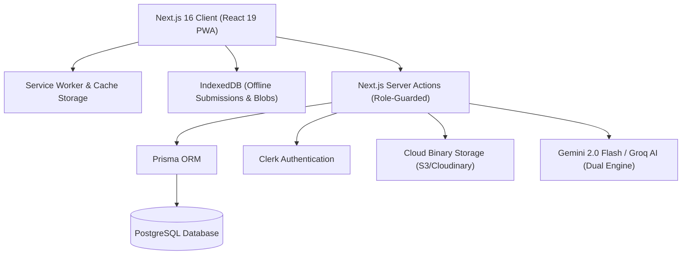
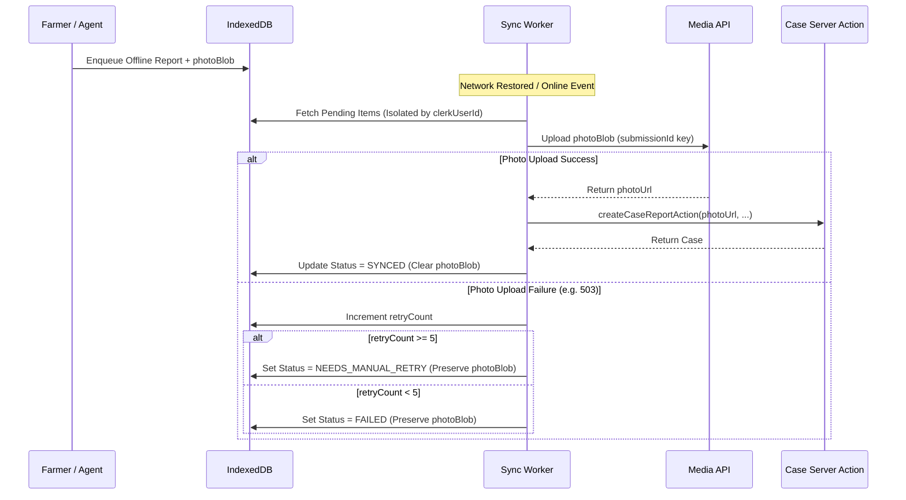
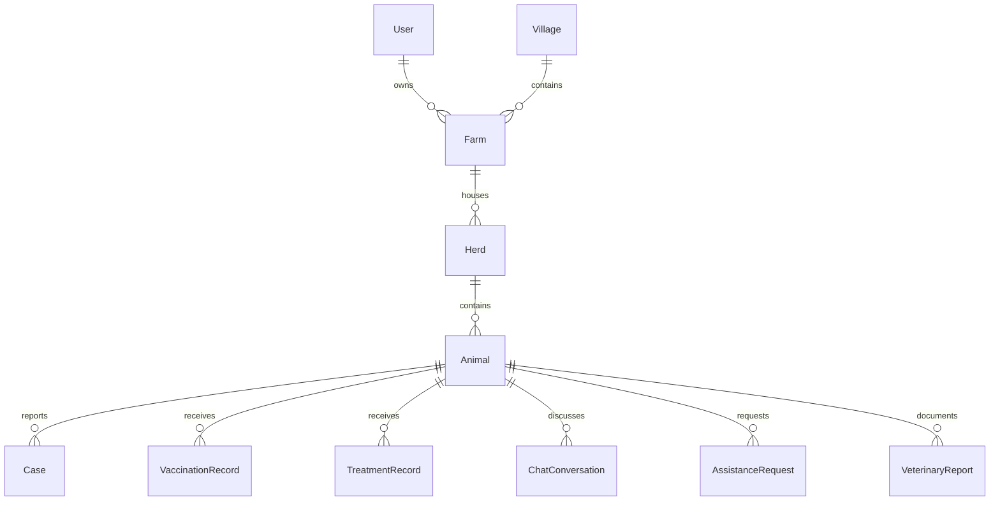

# Maitri (PS128) Platform Architecture

## Executive Overview
**Maitri** is an offline-first, multilingual livestock disease early warning and veterinary telemedicine platform designed for rural India (specifically Maharashtra district livestock ecosystems). The system links **Farmers**, **Field Agents (Pashumitras)**, **Veterinarians**, and **District Animal Husbandry Authorities** into a unified, fault-tolerant surveillance and clinical workflow.

---

## Technical Stack & Infrastructure

- **Frontend / Application Framework**: Next.js 16 (App Router) + React 19 + TypeScript + Tailwind CSS
- **Authentication & RBAC**: Clerk Auth with custom RBAC metadata and session synchronization
- **Database & ORM**: PostgreSQL with Prisma ORM
- **Offline Storage & Synchronization**: IndexedDB (`fake-indexeddb` / Native IDB), Web Locks API (`navigator.locks`), `BroadcastChannel`
- **Geospatial & Mapping**: Leaflet GIS with OpenStreetMap single-host raster tiles and vector circle markers
- **AI & Clinical Guardrails**: Google Gemini 2.0 Flash with Groq fallback and 5-layer structured safety guardrails

---

## 1. Offline-First Synchronization & Concurrency Subsystem

### A. Lifecycle of an Offline Submission
1. **Intake & Local Persistence**: When the farmer or agent captures a field report without connectivity:
   - Form inputs and raw camera photo binaries (`Blob`) are saved directly into IndexedDB (`OfflineQueueRecord`).
   - The report is tagged at enqueue time with the active `clerkUserId` and a unique client `submissionId`.
2. **Account Isolation (Hold-Never-Reassign)**:
   - `triggerQueueSync(currentClerkUserId)` strictly processes items matching the active Clerk user session.
   - Items belonging to previous or different accounts on the same device remain safely sealed in IndexedDB without cross-tenant leakage.
3. **Sync Execution & Photo Ingestion (F-01 / F-06 Unified Path)**:
   - When network connectivity returns, `uploadOfflinePhoto()` uploads the raw binary to persistent storage.
   - On photo upload success, `createCaseReportAction` creates the server record with the returned URL.
   - On photo upload failure or network timeout, the exception increments `retryCount`. If `retryCount >= 5`, status transitions to `NEEDS_MANUAL_RETRY` and preserves `photoBlob`.
4. **Retry Capping & Progressive Web Locks**:
   - Web Locks API (`navigator.locks.request("maitri_queue_sync_lock")`) prevents concurrent sync loops across browser tabs.
   - `NEEDS_MANUAL_RETRY` items are excluded from automated loops and surface a manual "Retry Now" action in `SyncStatusBadge`.

---

## 2. Actor Portals & Role Boundaries

### 1. Farmer Portal (`/farmer`)
- **Language Localization**: Complete dual Marathi (`mr`) and English (`en`) interfaces tailored for rural usability.
- **Animal Health Reporting**: Step-by-step intake capturing ear-tag ID, species, symptom taxonomy, duration, herd mortality, and photos.
- **Farmer Talk AI Assistant (`FarmerChatBox`)**:
  - Grounded on the animal's exact health history, vaccinations, and veterinary diagnoses.
  - 5-Layer Safety Guardrails: Enforces non-prescriptive advice, escalates high-risk cases to veterinarians, and rejects unauthorized prescription generation.
  - Optimistic UI with inline failure retry and localized prompt suggestions.

### 2. Field Agent (Pashumitra) Portal (`/agent`)
- **Territory Scoping**: Automatically filtered by assigned district, taluka (block), or village cluster.
- **Assistance Queue (`AgentAssistanceQueue`)**:
  - Optimistic concurrency control using `expectedUpdatedAt` timestamps across `acceptAssistanceRequestAction` and `startVisitAssistanceRequestAction`.
  - Seamless handoff to inspection recording with GPS and IoT telemetry integration.

### 3. Veterinarian Portal (`/vet`)
- **Clinical Triage Queue**: Ranked by automated risk scoring (`CRITICAL`, `HIGH`, `MEDIUM`, `LOW`).
- **Clinical Diagnostic Suite**: Case review, laboratory sample requests, symptom verification, prescription recording, and follow-up scheduling.

### 4. District Authority Portal (`/authority`)
- **GIS Surveillance Heatmap**: Live OpenStreetMap spatial mapping of disease clusters with village micro-offsetting, disease filtering, and zoom focus.
- **KPI Metrics**: District livestock count, active outbreak alerts, diagnostic turnaround times, and village-level case aggregations.
- **Emergency Broadcasts**: Multi-channel SMS and Telegram alert dispatching for localized biosecurity lockdowns.

---

## 3. Relational Data Model & Integrity Rules

### Deletion Integrity Safeguards (F-10)
- Animals with historical records cannot be deleted. `deleteFarmerAnimal` enforces an exhaustive check over:
  1. `cases` (Clinical history)
  2. `vaccinations` (Immunization history)
  3. `treatments` (Medication history)
  4. `conversations` (Farmer chat history)
  5. `assistanceRequests` (Field assistance visits)
  6. `veterinaryReports` (Formal clinical diagnoses)

---

## 4. Test Strategy & Triple Verification Gate

The platform mandates a three-tier quality gate for all changes:
1. **Automated Unit & Regression Tests** (`npm test`): Vitest with `@testing-library/react` and `jsdom`.
2. **Static Code Analysis** (`npm run lint`): ESLint with zero-tolerance for unused variables or type errors.
3. **Type Safety** (`npx tsc --noEmit`): Strict TypeScript compilation ensuring end-to-end interface contracts.
